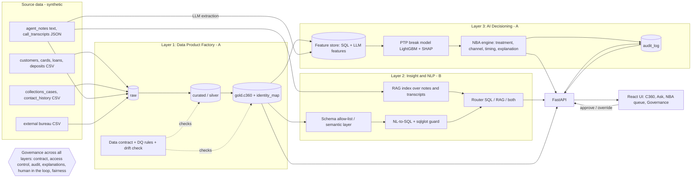

# Architecture: Collections 360 + Ask + Next Best Action

Educational prototype on fully synthetic data. Stack: Python 3.11, DuckDB, FastAPI, LightGBM, sqlglot, React + Vite + Tailwind.

## 1. Idea in one paragraph

A collections agent's view of a customer is scattered across cards, loans, deposits, collections cases, contact history, notes, transcripts and bureau data. We unify it into one governed **Collections 360 (C360)** data product, let teams **ask questions in plain English** with the SQL shown, and use the same data to recommend a **Next Best Action (NBA)** per customer with an explanation and a human approve/override step. One vertical slice through all three layers, with governance in every layer.

## 2. Diagram

## 3. Components and data flow

| Stage | Component | Detail | Owner |
|---|---|---|---|
| Source -> raw | Loader | Files loaded as-is into DuckDB schema `raw` | A |
| raw -> curated | Cleaning in SQL/Python | Typing, dedup, standardised dates/names/phones; bad rows to a reject table with reasons | A |
| curated -> gold | `gold.c360` + `gold.identity_map` | One row per golden customer; product rollups, max DPD and bucket, contact summary. Identity resolution: deterministic keys, then fuzzy match (rapidfuzz) with `match_confidence` and source IDs kept as lineage | A |
| Contract | `contracts/data_contract.yaml` | Owner, schema, quality rules, allowed/prohibited uses, PII class; enforced by the pipeline, reported in `dq_report.json` | A |
| gold -> features | Feature store (`gold.feature_store`) | One registry; the same function feeds offline training and online scoring | A |
| features -> decision | LightGBM promise-to-pay break model + NBA rules | Score, top reasons (SHAP), treatment/channel/timing within consent and contact-hour limits | A |
| gold -> NLQ | NL-to-SQL + RAG | Allow-listed schema, SQL guard, read-only DuckDB; RAG over notes/transcripts with citations | B |
| Serving | FastAPI | Endpoints per `contracts/api.md` | A (NLQ router: B) |
| UI | React | C360, Ask, NBA queue (approve/override), Governance | B |

## 4. Where AI is used, and why

| Layer | AI use | Why it earns its place |
|---|---|---|
| L1 | **Source-to-target mapping suggestions** (LLM proposes column mappings, reviewed by a human before commit) | Nine sources with inconsistent names; cuts mapping effort |
| L1 | **SQL transformation codegen** (LLM drafts curated/gold SQL, validated by tests and DQ rules) | Speed; tests catch wrong code |
| L1 | **Schema drift detection** (compare file columns/types with expected schema; LLM summarises the change) | Silent upstream changes are a top cause of broken pipelines |
| L1 | **Anomaly checks** (statistical outliers on DPD, balances, row counts) | Catches bad loads before they feed decisions |
| L2 | **NL-to-SQL** with `understood_as` tokens, SQL shown, refusal outside the allow-list | Non-technical teams get answers they can verify |
| L2 | **RAG** over agent notes and transcripts with citations | Free text holds the "why" behind missed payments |
| L3 | **LLM-extracted features**: `hardship_signal`, `stated_delay_reason`, `dispute_flag`, `ptp_intent_strength`, sentiment; each with prompt, version and a labelled eval | Turns text into model-ready, testable features |
| L3 | **Break-probability model** (LightGBM) | Ranks who needs attention first |
| L3 | **NBA explanations**: top 3 drivers in plain English, from SHAP, never free-form LLM invention | Agents must understand why an action is recommended |

Principle: the LLM proposes or extracts, deterministic code validates and decides. Numbers shown to users always come from SQL or the model, never from LLM text.

## 5. Governance controls per layer

| Layer | Control | How we show it |
|---|---|---|
| L1 | Published data contract (owner, schema, quality rules, allowed/prohibited uses) | Governance tab renders the contract |
| L1 | DQ rules run on every build; schema-drift check; reject table | DQ report with pass/fail counts |
| L1 | PII classified per column; lineage and match confidence per golden ID | Lineage panel on C360 |
| L2 | SELECT-only, table/column allow-list (sqlglot), enforced LIMIT, read-only connection, PII/protected columns blocked | Refusal state in Ask; guard unit tests |
| L2 | Out-of-scope questions refused with a reason; SQL and sources shown for every answer | Benchmark includes refusal cases |
| L3 | Protected attributes (age, gender, ethnicity, religion, marital status, postal code as proxy) excluded; a test asserts it | Fairness panel + test result |
| L3 | Hardship/vulnerability signal always routes to a human specialist, never to an automated aggressive treatment | Banner in NBA queue |
| L3 | Consent and contact-hour limits applied before a channel is chosen | Explanation cites the rule |
| L3 | Every decision has an explanation; every approval/override logged (who, when, inputs, model version, outcome) | Audit log tab |
| All | Human in the loop: nothing reaches a customer without a person able to review it | Approve/override with reason |
| All | Secrets in `.env`; synthetic data only; "Educational prototype" label | Footer, README |

## 6. Scalability path

| Prototype | Production path |
|---|---|
| DuckDB file, `python -m pipeline.run` | Cloud warehouse (medallion layers as schemas), orchestrated jobs (Airflow/dbt), same SQL ported |
| Batch rebuild | Streaming ingestion (CDC/Kafka) for contacts and payments; incremental C360 updates |
| Feature table in DuckDB | Feature store service with one definition for offline and online serving, low-latency lookup |
| LightGBM scored in batch | Model registry, scheduled retraining, drift and fairness monitoring, champion/challenger |
| NL-to-SQL over local DB | Semantic layer with governed metrics, row/column-level access by role, query cost limits |
| FastAPI single process | Containerised services, auth/SSO, rate limits, centralised audit store |

## 7. Business value

KPIs: **roll rate** (accounts moving to a worse DPD bucket), **cure rate** (accounts returning to current), **promise-to-pay (PTP) kept rate**, **contact efficiency** (successful contacts per attempt), **agent handle time**.

Illustrative impact, to be replaced with measured numbers from our synthetic data. Assumptions are ours, not bank figures:

| KPI | Baseline (assumed) | Mechanism | Target (assumed) |
|---|---|---|---|
| PTP kept rate | 60% | Prioritise likely-to-break promises, earlier reminders | +5 pts |
| Contact efficiency | 1 in 5 attempts succeeds | Channel and timing from response history | +15% relative |
| Handle time | 10 min per account | C360 replaces searching 9 systems; summary and reasons pre-built | -2 min (-20%) |
| Analyst question turnaround | Days via data request | Ask with visible SQL | Minutes |

Worked example: a team of 100 agents at about 60 accounts per day. A 2-minute saving on a 10-minute handle means the same workload needs about 80 agents instead of 100 (about 20 agent-equivalents of capacity freed, or 25% more accounts per agent). We will report only what the synthetic data supports, plus these assumptions stated openly.

## 8. Risks and mitigations

| Risk | Mitigation |
|---|---|
| LLM writes wrong or unsafe SQL | sqlglot guard, allow-list, read-only connection, retry once, benchmark with must-refuse cases |
| LLM-extracted features are unreliable | Labelled eval set (20+ examples), versioned prompts, cache, confidence thresholds, human override |
| Identity matching merges the wrong people | Confidence score shown, threshold with manual-review band, lineage kept to undo |
| Model bias or proxy discrimination | Exclude protected attributes and proxies, test for it, compare outcomes across segments |
| Messy data breaks the pipeline in 36h | Reject table, DQ gates, schema-drift check, idempotent rebuild |
| Scope creep with 2 people | Single vertical slice; non-goals fixed; feature freeze before submission |
| Demo fails live | Mock-mode UI, recorded backup video |
| Over-claiming | Labelled educational prototype, assumptions stated for every impact number |
