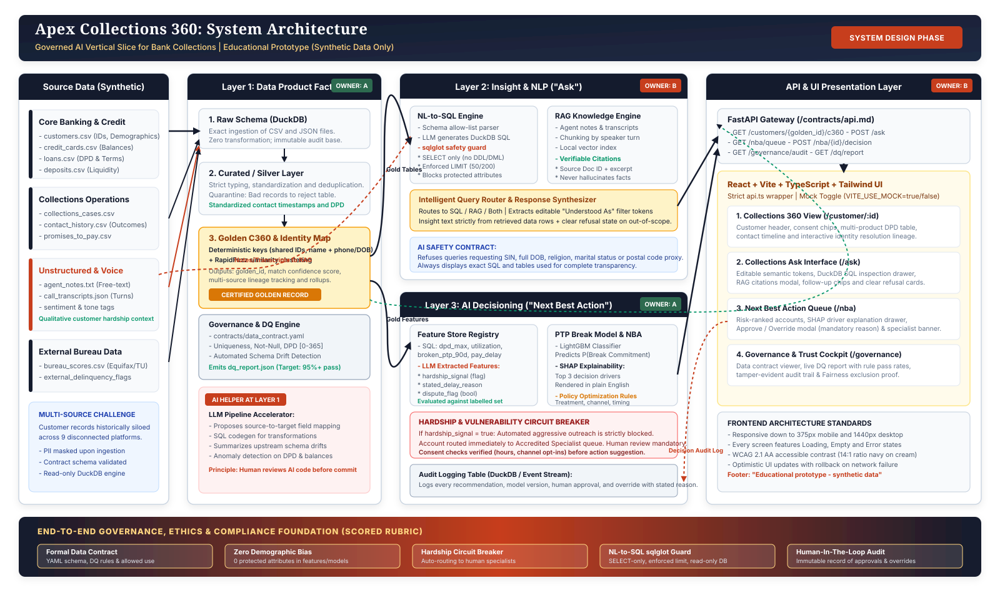

# Slide 2: End-to-End System Architecture

**Topic:** A Governed, Transparent Data Flow from Synthetic Sources to Front-of-House Cockpit  
**Visual Reference:** [`/docs/architecture.svg`](../../docs/architecture.svg)  

---

---

### Key Architectural Layers & Responsibilities

1. **Source Data Tier (Synthetic):**
   - Structured: Core banking customers, credit cards, loans, deposits, collections cases, contact history, bureau scores.
   - Unstructured: Agent free-text notes, customer call transcripts with speaker turns and sentiment tags.

2. **Layer 1: Data Product Factory (Owner: Person A):**
   - Medallion pipeline: `raw` (DuckDB) -> `curated` (Silver typed/deduped) -> `gold.c360` (Customer golden records).
   - Identity Resolution: Deterministic SIN hashing + RapidFuzz probabilistic matching (producing `match_confidence` and lineage source IDs).
   - Data Contract & Data Quality: Enforced via `contracts/data_contract.yaml`; outputs automated `dq_report.json`.

3. **Layer 2: Insight & NLP — "Collections Ask" (Owner: Person B):**
   - Schema allow-list parser & semantic metadata provider.
   - NL-to-SQL Engine protected by a `sqlglot` security guard (SELECT-only, enforced LIMIT 50/200, PII/protected column blocker).
   - RAG Knowledge Engine over chunked agent notes and call transcripts with verifiable source citations.
   - Intelligent Query Router directing questions to SQL, RAG, or hybrid execution.

4. **Layer 3: AI Decisioning — "Next Best Action" (Owner: Person A):**
   - Feature Store combining SQL aggregations (DPD, utilization, broken PTPs) with LLM features (`hardship_signal`, `stated_delay_reason`).
   - LightGBM PTP Break Risk model generating calibrated probabilities.
   - SHAP explainability engine rendering top 3 drivers in plain English.
   - Policy rules engine applying customer consent and legal contact windows.

5. **Presentation Layer (Owner: Person B):**
   - FastAPI gateway adhering strictly to `/contracts/api.md`.
   - React + Vite + TypeScript + Tailwind UI featuring C360, Ask, NBA Queue, and Governance Cockpit.
   - Zero-guess mock toggle (`VITE_USE_MOCK=true`) reading directly from `/contracts/mock/*.json`.

6. **Unified Governance Foundation:**
   - Transversal bar enforcing data contract rules, zero demographic bias, hardship escalation, and immutable decision audit logging.
